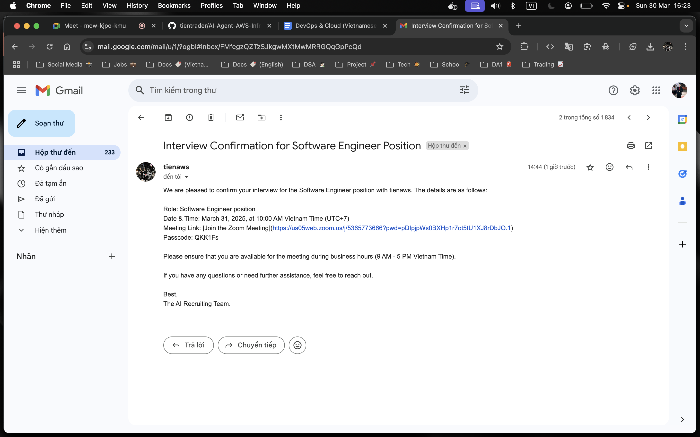

# 📌 AI-Powered Recruitment System on AWS

## 🚨 Project Overview

—

## 🏗 Terraform Infrastructure as Code

- **Infrastructure as Code (IaC)** using Terraform to provision AWS resources.
- Automates networking, security, compute, and storage configurations.

## 🏗 Architecture & Technologies

### 🧱 Infrastructure & Networking

-  **Virtual Private Cloud (VPC)**: A custom network setup with multiple subnets, including public, private, and database subnets, ensuring workload isolation and security.
- **Internet Gateway (IGW)**: Allows access to public resources from the internet, attached to the VPC.
- **NAT Gateway (NGW)**: Provides secure internet access for private subnets, associated with an Elastic IP.
- **Route Tables**:
  - Public route table directs traffic to the internet via IGW.
  - Private route table routes traffic via NGW.
- **Network ACLs (NACLs)**: Manages inbound and outbound traffic across subnets to enhance security.
- **Security Groups (SGs)**:
  - Public security group allows HTTP, HTTPS, and application-specific traffic.
  - Private security group restricts access, permitting only traffic from the load balancer.

---

### ⚖️ Load Balancing & DNS

-  **Application Load Balancer (ALB)**: Manages HTTP/HTTPS traffic and distributes it to services based on routing rules.

-  **Web Application Firewall (WAF)** &  **Amazon CloudFront**:

  - **WAF** protects against common security threats, including SQL Injection (SQLi) and Cross-Site Scripting (XSS).
  - **CloudFront** serves cached content globally for improved performance and security.

    - WAF
      
    - CLOUDFRONT
      

-  **Amazon Route 53**: Routes domain traffic to the appropriate endpoints.

-  **Certificate Manager (ACM)**: Provides SSL/TLS certificates to ensure secure communication over HTTPS.

---

### 🚀 Container Orchestration

-  **Elastic Container Service (ECS)**: A fully managed container orchestration service that simplifies the deployment, scaling, and management of containerized applications.
-  **Serverless Compute Engine (Fargate)**: Eliminates the need for server provisioning, allowing automatic scaling and resource optimization.

  - DEV
    
  - PROD
    

---

## ♻️ CI/CD Pipeline

This CI/CD pipeline is built using **AWS DevOps Services**, ensuring efficient and automated deployment. It leverages:

-  **AWS CodePipeline** for continuous integration and deployment automation.
-  **AWS CodeBuild** for compiling, packaging, and containerizing applications.
-  **AWS CodeDeploy** for automated and zero-downtime deployments.
-  **Amazon SNS** for deployment approval notifications and alerts.

-  **Amazon ECR** for secure container image storage.
-  **Docker** for containerization and efficient deployment.

---

### ⚙️ Build & Deployment Stages

1. **Code Commit & Build**

- Developers push code to the **GitHub repository**.
- AWS **CodePipeline** detects the changes and triggers the **CodeBuild** process.
- The application is compiled, packaged, and containerized.
- The built image is pushed to **ECR** for deployment.

  

2. **Development Deployment**

- The pipeline automatically deploys the new version to the **development environment** for testing whenever changes are pushed to the `dev` branch.

  

3. **Merge & Trigger Production Pipeline**

- Once the changes in the `dev` branch are tested and approved, they are merged into the `main` branch.
- **AWS CodePipeline for production** is configured to **only trigger when there is a new commit in the `main` branch**.

  

4. **Approval & Production Deployment**

- A manual approval step (e.g., via SNS) ensures only validated changes reach production.
- Once approved, the deployment proceeds to the production environment.

  

---

## 📡 Monitoring

###  **CloudWatch**

- **Monitoring & Logging**: Collects and stores logs from ECS containers for application tracking.
- **Log Insights**: Enables querying logs for error analysis and performance monitoring.
- **Alarms & Alerts**: Triggers alerts based on application errors or resource overuse.

  - **Logs**  
    

  - **Alarms**  
    

---

## 🛡️ Business Workflow

1. **Enter Database Configuration & Test Connection**

   - Users input database credentials and test the connection.

   

2. **Fill in Job & Candidate Information**

   - Input job roles, requirements, and upload CVs.

   

3. **CV Evaluation Process**

   - If a candidate passes, the system returns the evaluation results.

   
   

4. **Proceed with Interview Scheduling**

   - Proceed with Application

   

   - Send a confirmation email with Zoom meeting details.

   

5. **Rejection Workflow**

   - If the candidate fails, an evaluation is returned and a rejection email is sent immediately.

   
